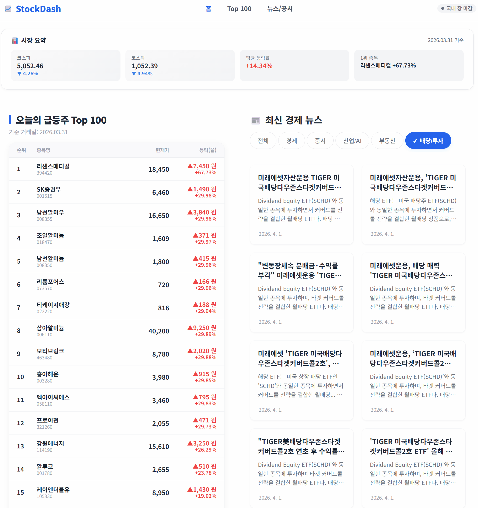
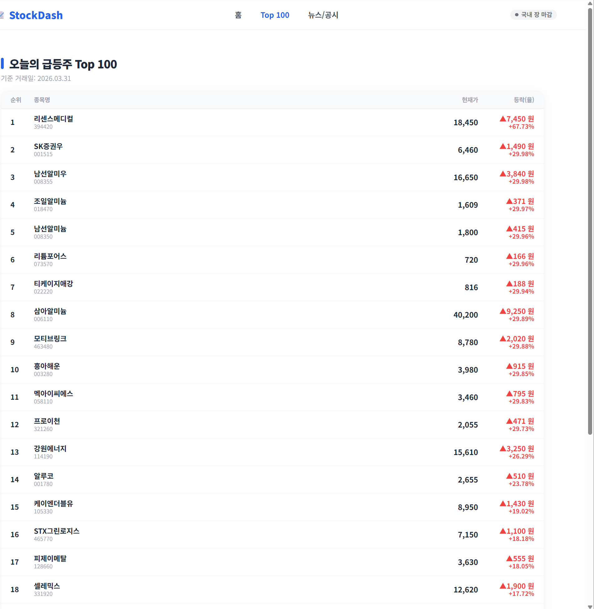
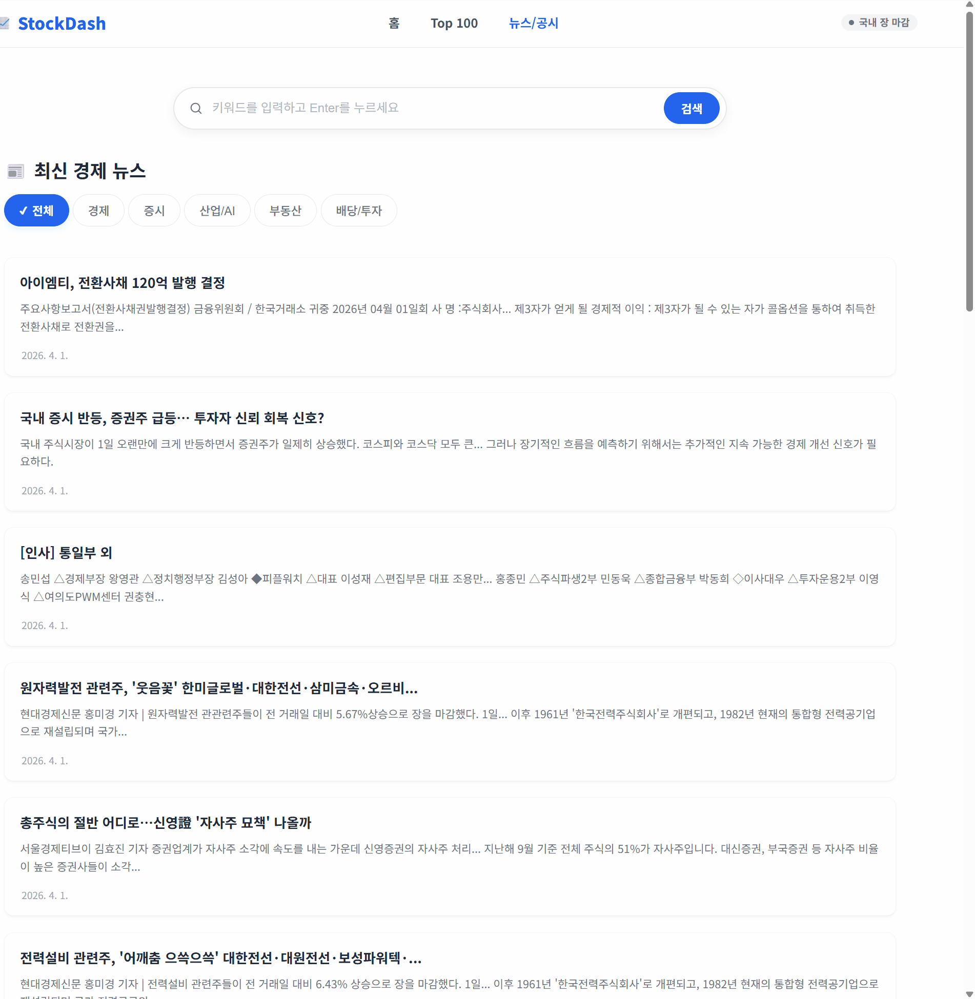
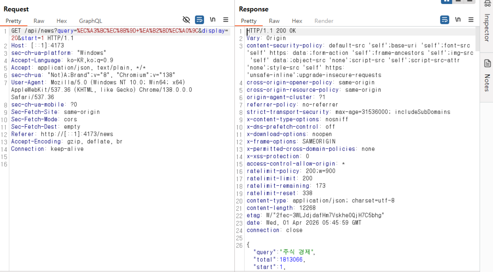
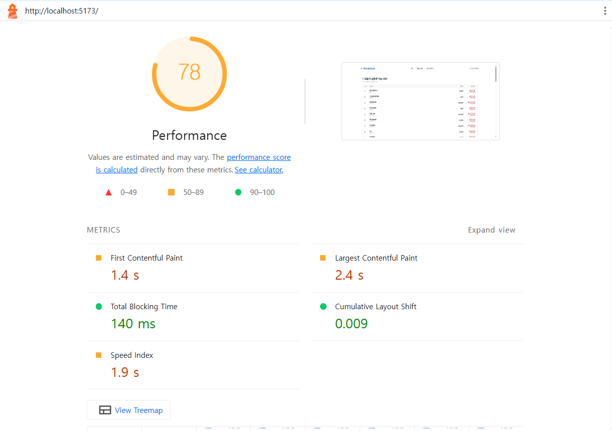
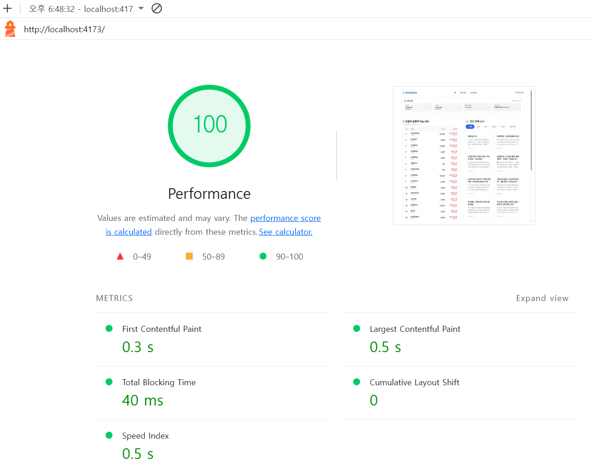
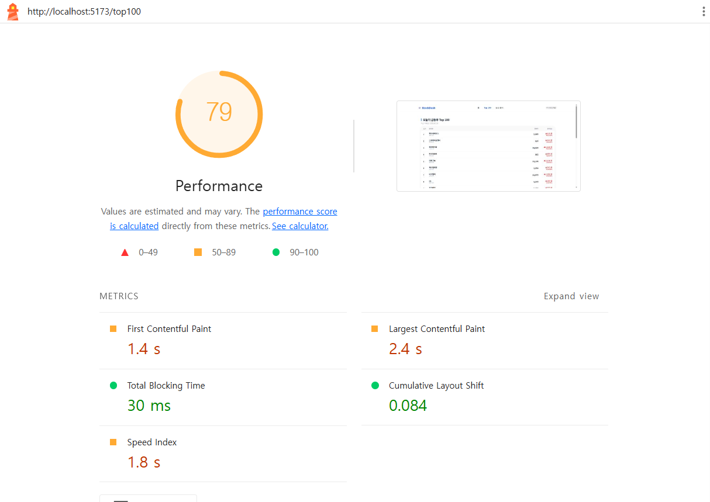
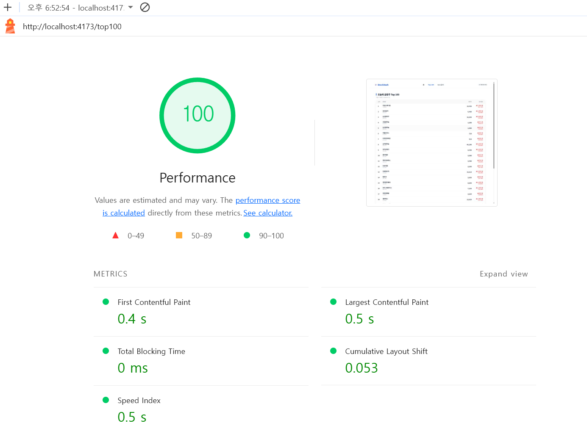
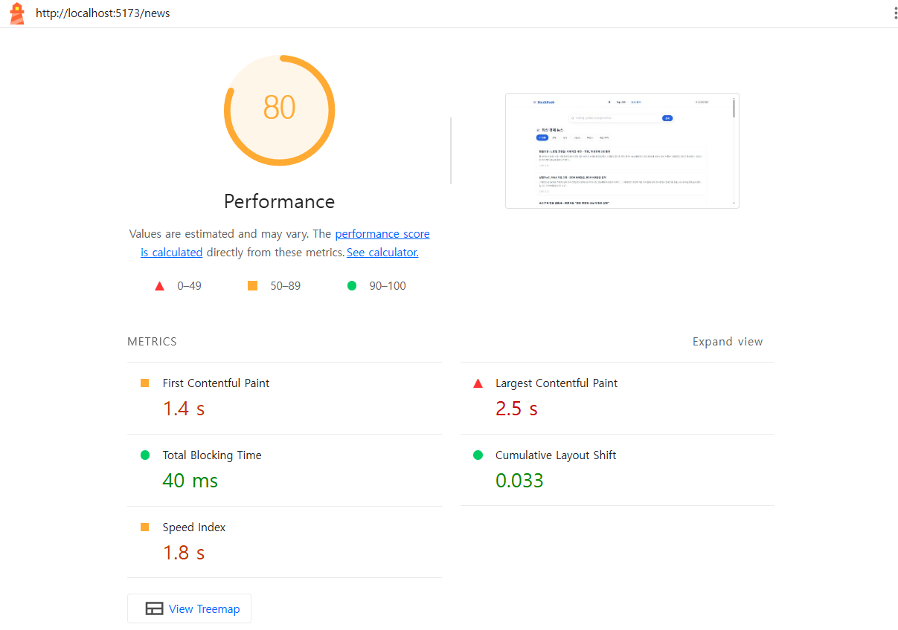
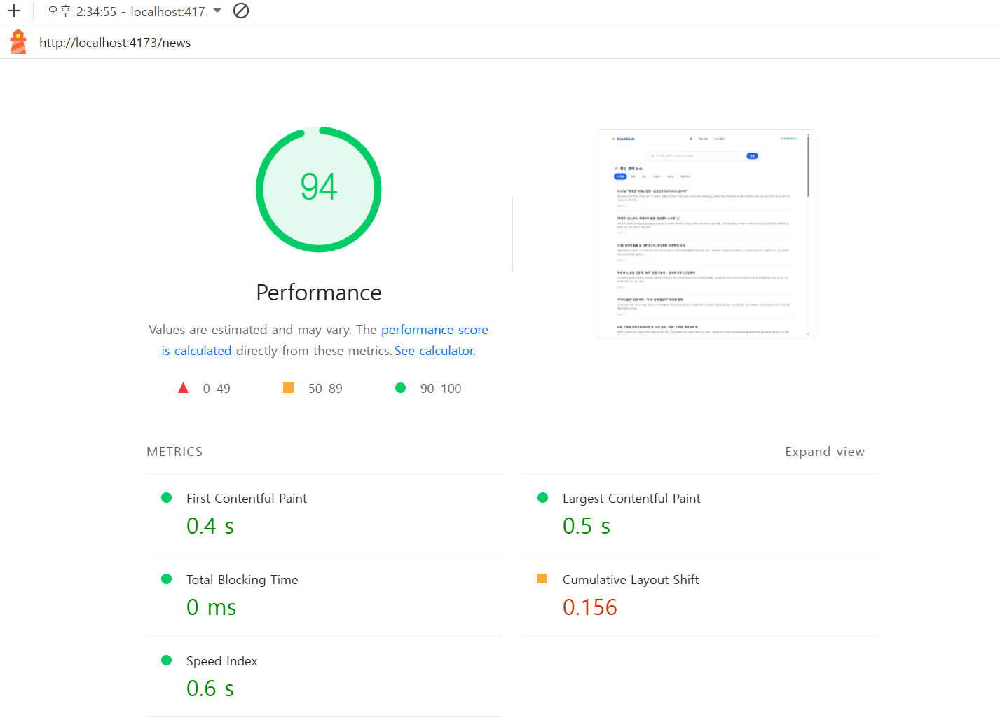

# 급등주 대시보드

국내 급등주 TOP100 시세와 경제뉴스를 한 화면에서 확인할 수 있는 SPA입니다.
실시간 데이터가 아닌 **전 영업일 기준** 데이터를 제공합니다.

---

## 메인탭



## Top100탭



## 뉴스탭



---

## 기술 스택

| 영역       | 스택                                                                         |
| ---------- | ---------------------------------------------------------------------------- |
| 클라이언트 | Vite 6, React 19, react-router-dom v7, Sass, Axios                           |
| 서버       | Express 4, TypeScript, ts-node-dev, dotenv, cors, helmet, express-rate-limit |
| 외부 API   | 공공데이터포털 주식시세 · 지수 · 휴일 API, 네이버 뉴스 검색 API              |

---

## 주요 기능

- **홈 대시보드** — 코스피 · 코스닥 지수, 평균 등락률, 1위 종목 요약 카드 / 급등주 TOP20 / 최신 경제뉴스
- **급등주 TOP100** — 무한 스크롤 (최대 100개), 종목 상세 모달
- **경제뉴스** — 카테고리별 탐색 · 키워드 검색, 무한 스크롤
- **UX** — React.lazy + Suspense 코드 스플리팅, ErrorBoundary, 404 페이지, Empty State, 재시도 버튼
- **캐싱** — 서버 인메모리 캐시 (TTL) + 클라이언트 stale-while-revalidate (localStorage / sessionStorage)

---

## 프로젝트 구조

```
geupdeung_v1/
├── .env                  # 환경변수 (루트 공유)
├── client/               # Vite + React SPA
│   └── src/
│       ├── components/   # UI 컴포넌트 (home, top100, news, layout, shared)
│       ├── hooks/        # 데이터 패칭 훅
│       ├── lib/          # 유틸리티 (정규화, 필터, fetch 함수)
│       └── pages/        # 라우트 페이지
└── server/               # Express API 서버
    └── src/
        ├── routes/       # /api/top100  /api/news  /api/market-index  /api/trading-day
        └── lib/          # 인메모리 캐시, 서비스 레이어, 환경변수 헬퍼
```

---

## 서버 미들웨어

| 미들웨어             | 용도                                                                    |
| -------------------- | ----------------------------------------------------------------------- |
| `helmet`             | HTTP 보안 헤더 자동 설정 (XSS 방지, 클릭재킹 방지, MIME 스니핑 방지 등) |
| `cors`               | 클라이언트 → 서버 간 Cross-Origin 요청 허용                             |
| `express-rate-limit` | IP당 15분에 최대 200회 요청 제한 — 초과 시 429 응답                     |
| `express.json()`     | JSON 요청 본문 파싱                                                     |

---

## 데이터 흐름

```
Browser
  └─ Vite proxy (/api) ──► Express 서버
                              ├─ 캐시 HIT  ──► 즉시 반환
                              └─ 캐시 MISS
                                    ├─ 공공데이터포털 API  (주식시세 · 지수 · 휴일)
                                    └─ 네이버 뉴스 검색 API
```

브라우저가 외부 API 키와 응답 구조를 직접 알지 못하도록 모든 외부 호출은 Express 서버를 경유합니다.

---

## 환경변수

루트에 `.env` 파일을 생성하고 아래 값을 설정합니다.

```env
# 공공데이터포털 (data.go.kr) — 주식시세 · 지수 서비스
STOCK_API_BASE_URL=
HOLIDAY_API_BASE_URL=
STOCK_SERVICE_KEY=

# 네이버 개발자센터 — 뉴스 검색 API
NAVER_CLIENT_ID=
NAVER_CLIENT_SECRET=
```

> `STOCK_API_BASE_URL`은 `GetStockSecuritiesInfoService` 까지 포함한 전체 경로를 입력합니다.

---

## 보안 개선 이력

### 1. API 키 로그 노출

**문제** — 서버 내부에서 외부 API 호출 시 서비스 키가 포함된 전체 URL을 `console.log`로 출력하고 있었습니다. 서버 로그가 유출될 경우 API 키가 그대로 노출될 위험이 있었습니다.

**해결** — `top100Service.js`, `indexService.js`, `marketCalendar.js`의 URL 및 디버그 로그를 전부 제거했습니다.

---

### 2. Rate Limiting 없음

**문제** — API 엔드포인트에 요청 횟수 제한이 없어, 반복 호출로 네이버 API · 공공데이터포털의 일일 할당량을 소진시킬 수 있었습니다.

**해결** — `express-rate-limit` 미들웨어를 적용해 **IP당 15분에 최대 200회**로 제한합니다. 초과 시 429 응답을 반환합니다.

```ts
// server/src/index.ts
const globalLimiter = rateLimit({
  windowMs: 15 * 60 * 1000,
  max: 200,
  message: { error: "요청이 너무 많습니다. 잠시 후 다시 시도해 주세요." },
});
app.use(globalLimiter);
```

---

### 3. 뉴스 검색 쿼리 미검증

**문제** — `/api/news`의 `query` 파라미터를 길이 제한이나 문자 필터 없이 Naver API에 그대로 전달하고 있었습니다.

**해결** — `sanitizeQuery` 함수를 추가해 최대 100자 제한 및 HTML 특수문자(`< > " ' &`)를 제거합니다.

```ts
// server/src/routes/news.ts
const sanitizeQuery = (value: string): string => {
  return value
    .trim()
    .slice(0, 100)
    .replace(/[<>"'&]/g, "");
};
```

---

### 4. HTTP 보안 헤더 미적용

**문제** — 응답에 보안 헤더가 없어 XSS, 클릭재킹, MIME 스니핑 등의 공격에 노출될 수 있었습니다.

**해결** — `helmet` 미들웨어를 적용해 아래 헤더를 응답에 자동으로 포함시킵니다.

| 헤더                              | 효과                       |
| --------------------------------- | -------------------------- |
| `X-Content-Type-Options: nosniff` | MIME 타입 스니핑 방지      |
| `X-Frame-Options: SAMEORIGIN`     | 클릭재킹(iframe 삽입) 방지 |
| `Strict-Transport-Security`       | HTTPS 강제 적용            |
| `Content-Security-Policy`         | 허용된 리소스 출처 제한    |



---

## LightHouse 개선

### SEO

- `meta description`, Open Graph 태그 추가 (검색 결과 및 SNS 공유 미리보기)
- `robots.txt`, `favicon.svg` 추가
- 페이지별 동적 `document.title` 적용 (Home / Top100 / 뉴스)

### Accessibility

- `TopItem`: `<li onClick>` → `role="button"` + `tabIndex` + `onKeyDown` 추가로 키보드 접근성 확보
- `Modal`: `role="dialog"`, `aria-modal` 추가, focus trap 및 Esc 키 닫기 구현
- 장식용 이모지에 `aria-hidden="true"` 추가 (스크린리더 불필요 읽기 방지)
- 검색 `<input>`에 `<label>` 및 `aria-label` 추가
- `user-scalable=no` 제거 (모바일 확대 허용, WCAG 준수)
- Footer 헤딩 계층 수정 (`h3` → `h2`, h1 → h2 → h3 순서 준수)

### Performance

- 페이지 컴포넌트(Top100, News, NotFound)에 `React.lazy` + `Suspense` 적용
  - 기존: 조건부 렌더링 로직으로 직접 처리
  - 변경: 라우트 진입 시점에 번들을 분리 로드해 초기 번들 크기 감소
- `reset.css`를 `style.scss`에 통합해 CSS 파일 요청 1건 감소

| 개선 전                                    | 개선 후                                   |
| ------------------------------------------ | ----------------------------------------- |
|      |       |
|  |  |
|      |      |
